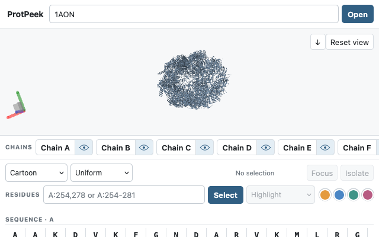

# ProtPeek

**View protein structures without leaving the paper you're reading.**

ProtPeek is a free, open-source protein-structure viewer for Firefox, Chromium, and Zotero desktop. It detects structural identifiers in scientific articles and opens the corresponding structures in the browser side panel or a Zotero viewer window.

It is intended for quick inspection while reading, not as a replacement for PyMOL, ChimeraX, Coot, or other full molecular-modelling tools.

[Chrome Web Store](https://chromewebstore.google.com/detail/protpeek/mjiidagjpbabdncmgpabcijgndnbemck) · [Firefox Add-ons](https://addons.mozilla.org/firefox/addon/protpeek/) · [Zotero download](https://github.com/MOMISBACK/ProtPeek/releases/download/zotero-v0.1.4/protpeek-zotero-0.1.4.xpi) · [Privacy](https://momisback.github.io/ProtPeek/privacy/)

The Zotero plugin is an installable prototype (0.1.4), with local GROMACS GRO support, improved PDB detection, harmonized typography, and a saved white/black viewer background. It scans local PDF and HTML attachments and reuses the same Mol* viewer. See [installation and usage](./zotero/README.md), [release notes](./zotero/RELEASE_NOTES.md), and [validation limits](./zotero/VALIDATION.md).



## Features

- Detects PDB, UniProt, and AlphaFold identifiers in web articles and Zotero attachments.
- Loads structures from RCSB PDB and AlphaFold DB.
- Opens local `.pdb`, `.cif`, `.mmcif`, `.bcif`, and `.gro` files.
- Shows chains, sequences, residues, ligands, colours, and molecular representations.
- Supports residue selection, focus/isolation, chain visibility, and surface rendering.
- Offers a white or black structure background, saved locally independently of the interface theme.
- Exports the visible structure as PDBx/mmCIF and the current view as PNG.
- No account, analytics, ads, telemetry, or ProtPeek-operated backend.

Article scanning and local-file processing happen on the device. Structure downloads contact RCSB PDB or AlphaFold DB only when you explicitly open a remote structure. Zotero may also check GitHub-hosted plugin-update metadata; these checks do not include document content.

## GRO files

Open or drop a local `.gro` file in the **Open** tab. Mol* converts its coordinates
from nanometres to ångströms. A concatenated GRO file opens its first frame; there
is no trajectory playback. GRO does not contain chain identifiers or explicit
bond topology, so chains and bonds are inferred. Velocities are not displayed,
and triclinic box geometry is not reconstructed.

## Development

Requirements: Node.js 22+ and npm.

```sh
npm ci
npm run dev:firefox
# or
npm run dev:chrome
```

Checks:

```sh
npm run typecheck
npm run lint
npm test
npm run build:firefox
npm run build:chrome
npm run verify:build
npm run build:zotero
npm run verify:zotero
```

Release archives for the browsers and Zotero:

```sh
npm run release
```

For Zotero publication, see the [release instructions](./zotero/README.md#publishing-a-zotero-release). CI publishes the verified `.xpi` after an explicit release tag or release commit.

For browser publication, CI publishes the Chrome ZIP, Firefox ZIP, and matching
source ZIP after a `browser-v<version>` tag or a main-branch commit containing
`[release-browser]`. Upload the browser ZIPs to the respective stores; Firefox
reviewers can rebuild the source ZIP with `npm ci` and `npm run zip:firefox`.

Main source areas:

- `src/article/` — identifier detection in article content
- `src/structures/` — identifier parsing and structure loading
- `src/viewer/` — Mol* integration
- `src/ui/` — side-panel UI
- `src/zotero/` and `zotero/` — desktop Zotero integration and plugin packaging
- `tests/` — Vitest test suite

See [CONTRIBUTING.md](./CONTRIBUTING.md) for contribution notes and [SECURITY.md](./SECURITY.md) for vulnerability reporting.

## Licence

ProtPeek source code is distributed under the [Mozilla Public License 2.0](./LICENSE).

The viewer uses [Mol*](https://molstar.org/). Third-party licences are listed in [public/THIRD_PARTY_NOTICES.txt](./public/THIRD_PARTY_NOTICES.txt).
